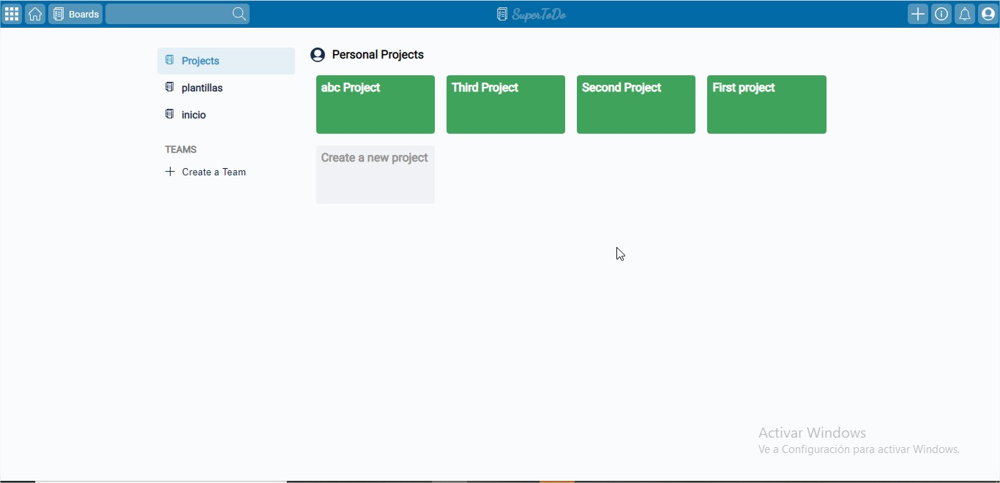
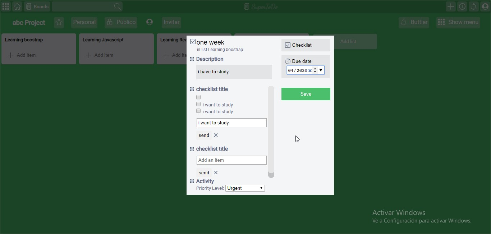
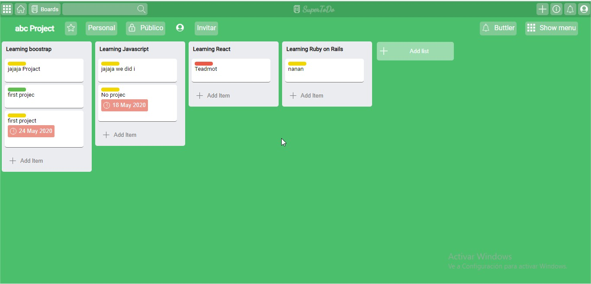

# JavaScript To do lists

In this project we created a To do list app. It has the following fuctionalities:
- create Projects;
- create lists on projects;
- create items on lists.
- create checklists, priority levels and due dates on Items
- This app follows the mvc pattern and crud actions

You can find the original description in [The Odin Project](https://www.theodinproject.com/courses/javascript)

## Built With

- HTML5 
- Sass
- JavaScript
- webpack 3
- npm

## Live Demo

[Live Demo Link](https://rawcdn.githack.com/bruna-genz/todo-list/261fbc6ced78de846890be0e6197e822e24b3f57/dist/index.html)

## Authors

:man: **Nicolás Mariño Parra**

- Github: [@nicolasmarino99](https://github.com/nicolasmarino99)
- Twitter: [@nicolasmarino99](https://twitter.com/nicolasmarino99)
- Linkedin: [Nicolás Mariño Parra](https://www.linkedin.com/in/nicol%C3%A1s-mari%C3%B1o-parra-45a707177/)

:woman: **Bruna Genz**

- Github: [@bruna-genz](https://github.com/bruna-genz)
- Twitter: [@Bruna_GK](https://twitter.com/Bruna_GK)
- Linkedin: [Bruna Genz](https://www.linkedin.com/in/brunagenz/)

## 🤝 Contributing

Contributions, issues and feature requests are welcome!

## Show your support

Give a ⭐️ if you like this project!
